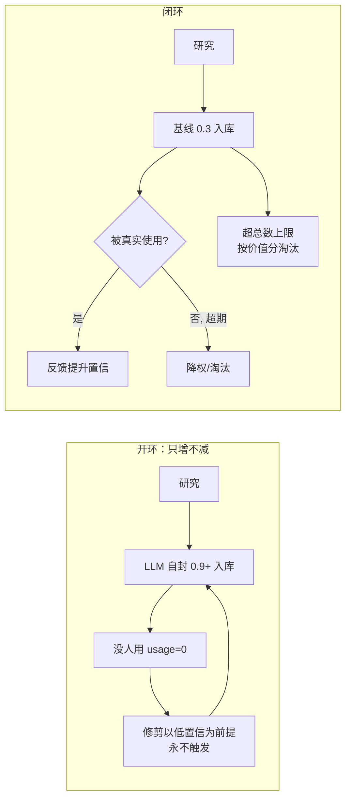

# 设计文档

## Overview

修复个人能力系统的"开环增殖"缺陷。核心是把一条**从未闭合的自我修正闭环**接通：让置信度真实反映使用、让未使用能力自然退场、给增殖加硬上限、统一并泛化去重、暴露体检入口、迁移存量。

改动集中在三个文件：

- `anima/mixins/capabilities.py`：`_create_or_update_capability`（置信度脱钩）、`_maintain_capabilities_health`（未使用敏感 + 硬上限 + 复用创建期去重）、`_get_personal_capabilities_injection`（按价值分排序）、新增 `_migrate_capabilities_v094` / `_capability_value_score` / `_audit_capabilities`。
- `anima/capability_dedup.py`：增加通用文本相似度路径，泛化去重。
- `anima/mixins/danger.py`：两处合成路径不再传 LLM 自报 confidence。
- `main.py`：新增 `/anima_capabilities_audit` 命令；dispatcher 的能力解析加模糊匹配；`initialize()` 触发存量迁移。
- `_conf_schema.json`：4 个新配置项。

所有改动遵循既有降级原则：能力系统失败绝不影响主流程；`capability_system_enabled` 关闭时全部短路。

## Architecture

### 闭环修复前后对比



### 关键不变量

- **置信度单调来源**：新建 = 基线；只有 `_apply_capability_feedback` 能提升；未使用能力的置信度不超过基线。
- **退场有两条独立通道**：未使用超期（按天数，无视置信度）+ 总数超限（按价值分）。
- **去重单一来源**：创建期与维护期都走 `_find_similar_capability`。

## Components and Interfaces

### P0-1：置信度脱钩（capabilities.py + danger.py）

`danger.py` 两处合成 payload 删除 `"confidence": float(cap_data.get(...))` 这一行（不再把 LLM 自评写进 payload）。`_create_or_update_capability` 新建分支：

```python
capability.setdefault("usage_count", 0)
# v0.9.4: 置信度从未验证基线起步，忽略 LLM 自评；只有真实使用反馈能提升
baseline = float(self.config.get("capability_initial_confidence", 0.3))
capability["confidence"] = min(capability.get("confidence", baseline), baseline) \
    if capability.get("usage_count", 0) == 0 else capability.get("confidence", baseline)
capability.setdefault("corrections", [])
```

> 实现要点：合并更新已有能力时不动 confidence（由反馈闭环维护）；仅新建时套基线。`_apply_capability_feedback` 的 `min(0.98, old+0.08)` 提升逻辑保持不变——这是唯一合法的提升入口。

### P0-2 & P1：健康维护重构（capabilities.py `_maintain_capabilities_health`）

新流程（替换现有实现，保留日记/演化日志记录）：

```
1. 遍历，按"未使用超期"判定（无视 confidence）：
   - usage==0 且 days>capability_unused_drop_days  → 淘汰
   - usage==0 且 days>capability_unused_decay_days  → confidence *= 0.9（下限 0.05）
   - 保留旧规则：conf<0.2 且 usage<=1 且 days>25 → 淘汰
2. 去重合并：用 _find_similar_capability（替换 name[:12]），累计 usage + 合并 corrections
3. 硬上限：若剩余数 > capability_max_total，按 _capability_value_score 升序淘汰最差者到上限
4. 持久化 + 演化日志（记录淘汰/降权/合并/超限淘汰数量）
```

价值分（不含自封 confidence）：

```python
def _capability_value_score(self, cap, now=None) -> float:
    now = now or datetime.now()
    usage = cap.get("usage_count", 0)
    corr = len(cap.get("corrections", []))
    try:
        days = (now - datetime.fromisoformat(cap.get("last_updated", ""))).days
    except Exception:
        days = 999
    recency = max(0.0, 1.0 - days / 90.0)   # 90 天线性衰减到 0
    return usage * 2.0 + corr * 0.5 + recency
```

> 去重复用注意：`_find_similar_capability(cap, kept_list)` 在"逐个加入 kept"的循环里调用（与创建期同构），命中则并入而非新增。

### P1：去重泛化（capability_dedup.py）

`find_similar_capability` 在现有语义槽位判定**之后**追加一条通用文本相似度兜底：

```python
# 现有：核心槽位/覆盖率匹配 ...
# 新增：通用文本相似度（覆盖无核心槽位的中文长名）
if not matched:
    sim = _text_similarity(name + " " + description, c_name + " " + c_desc)
    if sim >= text_threshold:   # 默认 0.6
        matched = True
```

`_text_similarity` 用字符级 n-gram（2-gram）的 Jaccard，对中文长名稳健，不依赖分词：

```python
def _text_similarity(a: str, b: str) -> float:
    ga, gb = _char_ngrams(a, 2), _char_ngrams(b, 2)
    if not ga or not gb:
        return 0.0
    return len(ga & gb) / len(ga | gb)
```

阈值 `0.6` 偏高，保证"不相关能力不误合并"的既有断言（天气/日记/代码格式化/问候语彼此 2-gram 重叠极低）继续通过。阈值由调用方从 config 传入（保持纯函数：`find_similar_capability(..., text_threshold=0.6)`，mixin 侧从 `capability_dedup_text_threshold` 读取传入）。

### P2：体检命令（main.py + capabilities.py）

`_audit_capabilities()`（只读，不调 LLM）返回 dict；命令 `/anima_capabilities_audit` 渲染文本：

```python
def _audit_capabilities(self) -> dict:
    caps = self._read_personal_capabilities().get("capabilities", [])
    baseline = float(self.config.get("capability_initial_confidence", 0.3))
    zero_use = [c for c in caps if c.get("usage_count", 0) == 0]
    inflated = [c for c in zero_use if c.get("confidence", 0) > baseline]
    return {
        "total": len(caps),
        "avg_conf": (sum(c.get("confidence",0) for c in caps)/len(caps)) if caps else 0,
        "total_usage": sum(c.get("usage_count",0) for c in caps),
        "total_corrections": sum(len(c.get("corrections",[])) for c in caps),
        "zero_use": len(zero_use),
        "inflated": len(inflated),
        "inflated_samples": [c.get("name","") for c in inflated[:8]],
    }
```

### P2：存量迁移（capabilities.py，initialize 触发）

```python
def _migrate_capabilities_v094(self):
    caps = self._read_personal_capabilities()
    if caps.get("migrated_v094"):
        return
    baseline = float(self.config.get("capability_initial_confidence", 0.3))
    changed = 0
    for c in caps.get("capabilities", []):
        if c.get("usage_count", 0) == 0 and c.get("confidence", 0) > baseline:
            c["confidence"] = baseline
            changed += 1
    caps["migrated_v094"] = True
    self._write_personal_capabilities(caps)
    if changed:
        logger.info(f"[Anima] v0.9.4 能力存量迁移：{changed} 条 0 使用能力置信度归正为 {baseline}")
```

在 `main.py` 的 `initialize()` 里调用（受 `capability_system_enabled` 控制；不删数据，安全）。

### P2：模糊名解析（main.py dispatcher）

dispatcher 的 `call` 与 `_execute_single_capability` 查找目标能力时，精确匹配失败后追加：不区分大小写子串匹配 → 文本相似度最高且达阈值者。复用 `capability_dedup._text_similarity`。

### P2：注入按价值分排序（capabilities.py `_get_personal_capabilities_injection`）

`sorted(..., key=lambda x: x.get("confidence",0))` 改为 `key=self._capability_value_score`，让真实用过的能力优先注入；并在引导语里加一句"按当前场景主动调用最贴合的已有能力"。

## Data Models

### 能力字典新增/变化字段

- `confidence`：语义变为"经使用验证的可靠度"，新建恒为基线。
- `migrated_v094`：写在能力库顶层（非单条），bool 迁移标记。

### 配置项（_conf_schema.json 新增）

```jsonc
"capability_initial_confidence": { "type": "float", "default": 0.3,
  "hint": "⚪ Token 无。新建个人能力的未验证基线置信度。LLM 自报置信度被忽略，只有真实使用反馈能提升。调低=更保守" },
"capability_unused_decay_days": { "type": "int", "default": 14,
  "hint": "⚪ Token 无。能力 0 使用且超过此天数 → 健康维护时降权（无视自封置信度）" },
"capability_unused_drop_days": { "type": "int", "default": 30,
  "hint": "⚪ Token 无。能力 0 使用且超过此天数 → 健康维护时淘汰" },
"capability_max_total": { "type": "int", "default": 40,
  "hint": "⚪ Token 无。个人能力总数硬上限，超出时按价值分（使用/修正/新近度，不含自封置信度）淘汰最差者" }
```

## Correctness Properties

### Property 1: 新建能力置信度恒为基线
*对任意* LLM 自报 confidence 值与任意 payload，`_create_or_update_capability` 新建出的能力其 `confidence` 等于 `capability_initial_confidence`（不被自报值抬高），且 `usage_count == 0`。
**Validates: Requirements 1.2, 1.3, 1.5**

### Property 2: 未使用能力的退场单调性
*对任意* 能力集合与天数配置，`_maintain_capabilities_health` 后：所有 `usage_count==0 且 days>drop_days` 的能力被淘汰；所有 `usage_count==0 且 decay_days<days<=drop_days` 的能力置信度被乘 0.9（下限 0.05）；这两类判定不依赖能力当前 confidence。
**Validates: Requirements 2.1, 2.2**

### Property 3: 硬上限不变量
*对任意* 能力集合，`_maintain_capabilities_health` 后能力数 `<= capability_max_total`；被淘汰者的价值分不高于被保留者中的最小值。
**Validates: Requirements 3.2, 3.3**

### Property 4: 去重不误合并且同概念合并
*对任意* 一对能力，泛化后的 `find_similar_capability` 对既有"不相关 4 能力"样本仍判不合并；对字符 2-gram Jaccard ≥ 阈值的一对判合并。
**Validates: Requirements 4.2, 4.3, 4.4**

### Property 5: 存量迁移只归正未使用且幂等
*对任意* 能力库，`_migrate_capabilities_v094` 仅把 `usage_count==0 且 confidence>baseline` 的能力降到基线，保留 `usage_count>0` 的置信度不变，不删任何能力，且第二次调用为空操作（幂等）。
**Validates: Requirements 6.1, 6.2, 6.3, 6.4**

### Property 6: 价值分不含自封置信度
*对任意* 两条能力，若二者 `usage_count`/`corrections`/`last_updated` 相同而 `confidence` 不同，则其 `_capability_value_score` 相等。
**Validates: Requirements 3.3**

## Error Handling

| 场景 | 策略 | 需求 |
| --- | --- | --- |
| 能力库读取失败 | 返回默认空结构，不抛 | 8.1 |
| 迁移时单条字段缺失 | `.get` 兜底，跳过该条 | 6.1 |
| 去重文本相似度异常 | 捕获返回 0.0（视为不相似） | 4.2 |
| 健康维护异常 | 既有 try 兜底，不影响沉淀链 | 2.4 |
| `capability_system_enabled` 关闭 | 迁移/创建/注入/命令全部短路 | 8.3 |

## Testing Strategy

- **单元/示例测试**：置信度脱钩（P0-1）、健康维护未使用规则与硬上限（P0-2/P1）、迁移幂等、体检输出、模糊名解析、配置项存在性。
- **属性测试（Hypothesis，≥100 迭代，每属性单测试）**：覆盖上述 6 条 Correctness Property。
- **回归**：既有 `test_capability_dedup.py` 全部断言必须继续通过（去重泛化不得提高误合并率）；既有 220 测试全绿。
- 测试基础设施沿用 `tests/test_v090_stats.py` 的 `types.ModuleType` 桩 + 最小宿主类约定。
