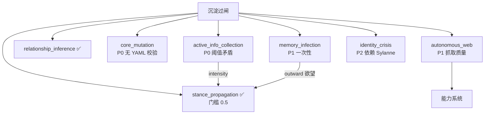

# 设计文档

## Overview

整合"高危功能审计"与"能力闭环审计"两份结论，分三层修复高危功能层（`danger.py`）及其横切缺陷：

- **P0（明确 bug / 数据安全）**：主动信息收集的 intensity 阈值矛盾；核心突变写 `persona_core.yaml` 前缺 YAML 校验。
- **P1（理念落地 / 质量）**：记忆感染加重复+追踪；自主网络抓取多标签提取。
- **P2（解耦 / 可观测）**：身份危机内生触发源；补齐内部 LLM 埋点；高危功能依赖透明化。

改动集中在 `anima/mixins/danger.py`、`anima/mixins/rumination.py`（埋点）、`main.py`/`_conf_schema.json`（配置与命令无新增，仅 hint）。所有高危功能默认关闭，本特性不改变默认行为。

## Architecture

### 高危功能链路现状（修复点标注）



### 关键设计约束

- **不改 stance_propagation 的 0.5 门槛**：它是经 v0.8.x 多轮加固的稳定值。改的是"上游欲望该用多少 intensity"，用配置开关让 active_info_collection 自己选择能否越过门槛。
- **YAML 校验用 PyYAML**：项目未声明 yaml 依赖，但 AstrBot 运行时通常自带。设计上**软依赖**：import 失败时退化为"基础结构字符串检查"，绝不因缺 yaml 而中断。
- **埋点零侵入**：仅在已有 `llm_generate` 成功返回处加一行 `_stat_bump`，不改调用结构。

## Components and Interfaces

### P0-1：Active_Info_Collection 阈值修复（danger.py）

当前写死 `"intensity": 0.4`。改为按开关取值：

```python
can_speak = self.config.get("active_info_collection_can_speak", False)
intensity = 0.55 if can_speak else 0.4   # 0.55 > stance 门槛 0.5；0.4 维持旧保守行为
```

> 0.55 留出余量：stance 门槛是 `> 0.5`，且每轮 `*0.95` 衰减，0.55 至少能在产生当轮越过门槛。其余防线（话题相关性/叙事腔/去重）不变，仍能拦住跑题发问。

### P0-2：Core_Mutation YAML 校验（danger.py）

在 `new_core` 写文件前插入校验：

```python
def _validate_persona_core(self, text: str) -> bool:
    """校验改写后的 persona_core 是否安全可写。"""
    if "用户主权" not in text:
        return False
    try:
        import yaml
        data = yaml.safe_load(text)
        if not isinstance(data, dict):
            return False
        if "core_beliefs" not in data:   # 关键顶层结构
            return False
        return True
    except ImportError:
        # 软依赖：无 yaml 时退化为基础结构检查
        return ("core_beliefs:" in text and "用户主权" in text)
    except Exception:
        return False
```

写入处：`if not self._validate_persona_core(new_core): logger.warning(...); return`（替换现有仅查 `"用户主权"` 的分支）。`.bak` 备份与 mutation_history 记录保留。

### P1-1：Memory_Infection 重复 + 追踪（danger.py）

当前：生成一条 outward 欲望，stance 发一次即 `satisfied`。改造：

- 感染欲望写入时带 `repeat_count: 0` 与 `max_repeats`（从 `memory_infection_max_repeats` 读，默认 2）。
- **不在 stance 首次发言后立即 satisfied**：stance_propagation 通用满足逻辑对 `source=="memory_infection"` 的欲望特殊处理——发一次则 `repeat_count += 1`，达到 `max_repeats` 才 `satisfied`，否则保留在队列里（下轮高情绪仍可能再被强调）。
- 满足检查：复用既有 `_check_desire_satisfaction` —— 对方消息命中感染信息关键词 → 提前 `satisfied`（视为已记住）。

> 实现注意：stance_propagation 的 satisfied 逻辑当前是无条件 `satisfied=True`。改为按 source 分支：memory_infection 走"累加 repeat_count"路径，其余维持原样。这是对 stance_propagation 的最小侵入式修改，需配套回归测试确认其它 source 行为不变。

### P2-1：Identity_Crisis 内生触发（danger.py）

`_danger_identity_crisis_update(sylanne_state)` 增加不依赖 Sylanne 的信号（在现有 Sylanne 分支之外追加）：

```python
# 既有：Sylanne 状态驱动（保留）
# v0.9.5 新增内生信号：
state = self._load_state()
# 1. 高情绪 + identity_denial 伤痕被触及
last_emotion = state.get("last_emotion_score", 0)
scars = self._read_scar_dimensions()
if last_emotion > 0.85 and "identity_denial" in scars:
    self._identity_stability = max(0.0, self._identity_stability - 0.08)
# 2. 近 48h 有核心突变
mut = state.get("mutation_history", [])
if mut:
    try:
        if (datetime.now() - datetime.fromisoformat(mut[-1]["timestamp"])).total_seconds() < 48*3600:
            self._identity_stability = max(0.0, self._identity_stability - 0.05)
    except Exception:
        pass
```

> 函数签名保持 `(sylanne_state)` 不变（调用方在 sediment.py 不动）；内部自行读 state。恢复机制不变。

### P1-2：Autonomous_Web 抓取改进（danger.py `_fetch_url`）

`_TextExtractor` 扩展：

- 采集标签从 `{p}` 扩到 `{p, li, h1, h2, h3, div}`。
- 维护 `skip_depth`：进入 `<script>`/`<style>` 时不采集其 data。
- 段数上限从 20 提到 60，字符上限从 500 改为 `autonomous_web_extract_chars`（默认 1500）。
- 去重相邻重复段、过滤长度 < 4 的碎片。

签名 `_fetch_url(self, url)` 不变，内部读 config 取上限。

### Requirement 6：埋点补齐（多文件）

在以下 `llm_generate` 成功返回后各加一行（与既有 `if hasattr(self, "_stat_bump")` 同模式）：

| 位置 | key |
| --- | --- |
| rumination.py `_rumination_task` | `llm.rumination` |
| rumination.py `_maybe_detect_contradiction` | `llm.contradiction` |
| danger.py `_danger_core_mutation`（type + mutation 各一次或合计） | `llm.mutation` |
| danger.py `_danger_active_info_collection` | `llm.info_collection` |
| danger.py `_danger_memory_infection_check` | `llm.memory_infection` |
| danger.py `_danger_autonomous_web` 合成处 | `llm.research_synthesis` |

> 能力 dispatcher 执行 / 工具日记 / 规律总结的调用属于"能力系统/工具学习"开销，本特性聚焦高危+反刍+矛盾，能力执行类埋点留待后续（避免范围蔓延）。

### Requirement 7：依赖透明化（_conf_schema.json + danger.py 日志）

- 三个依赖 `desire_enabled` 的高危项 hint 末尾加"（需同时开 `desire_enabled` 才生效）"。
- 各函数因 `desire_enabled` 关闭而 return 处，加一次性 debug 日志（用实例标志位避免每轮刷屏）。

## Data Models

### 感染欲望新增字段

```python
{
  "source": "memory_infection",
  "kind": "outward",
  "repeat_count": 0,           # v0.9.5
  "max_repeats": 2,            # v0.9.5，来自 memory_infection_max_repeats
  ...（其余同旧）
}
```

### 配置项（_conf_schema.json 新增）

```jsonc
"active_info_collection_can_speak": { "type": "bool", "default": false,
  "hint": "⚪ Token 无。默认主动信息收集只作上下文暗示（不主动发问）；开启后允许把问题真正发到群里（intensity 越过 stance 门槛）。需同时开 danger_active_info_collection + desire_enabled" },
"memory_infection_max_repeats": { "type": "int", "default": 2,
  "hint": "⚪ Token 无。同一条记忆感染信息被主动强调的最大次数，达到后标记满足。对方提及相关信息会提前满足" },
"autonomous_web_extract_chars": { "type": "int", "default": 1500,
  "hint": "⚪ Token 无。自主网络抓取提取的正文字符上限（v0.9.5 从 500 提升，多标签提取）" }
```

三个 desire 依赖项的 hint 追加说明（描述不变）。

## Correctness Properties

### Property 1: 信息收集 intensity 与开关一致
*对任意* `active_info_collection_can_speak` 取值，写入欲望的 intensity 在 `can_speak=true` 时 `> 0.5`（可越过 stance 门槛），`false` 时 `<= 0.5`（不可）。
**Validates: Requirements 1.2, 1.3**

### Property 2: YAML 校验拒绝非法输入
*对任意* 文本，`_validate_persona_core` 返回 true 当且仅当：含"用户主权" 且（yaml 可用时解析为含 `core_beliefs` 的 dict / yaml 不可用时含 `core_beliefs:` 字面）；畸形/截断/非映射/缺 core_beliefs 一律返回 false。
**Validates: Requirements 2.1, 2.2, 2.4**

### Property 3: 感染重复上限
*对任意* `max_repeats` 与强调序列，一条感染欲望被强调的次数不超过 `max_repeats`，且达到上限或命中满足关键词后 `satisfied==true`。
**Validates: Requirements 3.1, 3.2, 3.3, 3.4**

### Property 4: 抓取多标签且过滤脚本
*对任意* 含 `<p>/<li>/<h2>/<div>` 正文与 `<script>/<style>` 噪音的 HTML，提取结果包含正文标签文本、不含 script/style 文本、总长不超过上限。
**Validates: Requirements 5.1, 5.2, 5.3**

### Property 5: 身份危机内生触发不依赖 Sylanne
*对任意* 空 `sylanne_state`，当 last_emotion>0.85 且 identity_denial 伤痕存在、或近 48h 有突变时，`_identity_stability` 严格下降；否则不因内生信号下降。
**Validates: Requirements 4.1, 4.2, 4.3**

## Error Handling

| 场景 | 策略 | 需求 |
| --- | --- | --- |
| 缺 PyYAML | `_validate_persona_core` 退化为字符串结构检查 | 2.1 |
| YAML 解析异常 | 返回 false，放弃写入，保留原文件 | 2.2 |
| 抓取标签解析异常 | 既有 try 兜底，返回已采集部分或空 | 5.4 |
| state 读取失败（身份危机内生） | `.get` 兜底，跳过内生信号 | 4.1 |
| 埋点失败 | `_stat_bump` 自身吞异常 | 6.7 |

## Testing Strategy

- **单元/示例测试**：阈值开关取值（P1）、YAML 校验各分支（P2）、感染重复计数与满足（P3）、身份危机内生信号（P5）、抓取 HTML 解析（P4）、新增埋点触发、配置项存在性。
- **属性测试（Hypothesis，≥100 迭代，每属性单测试）**：覆盖上述 5 条 Correctness Property。
- **回归**：既有 236 测试全绿；特别确认 stance_propagation 对非 memory_infection source 的 satisfied 行为不变（`test_stance_filter` / `test_v089_stance_leak` 等）。
- 测试基础设施沿用 `tests/` 现有 `types.ModuleType` 桩 + 最小宿主类约定；`_fetch_url` 的 HTMLParser 提取可纯本地测试（不需真实网络）。
