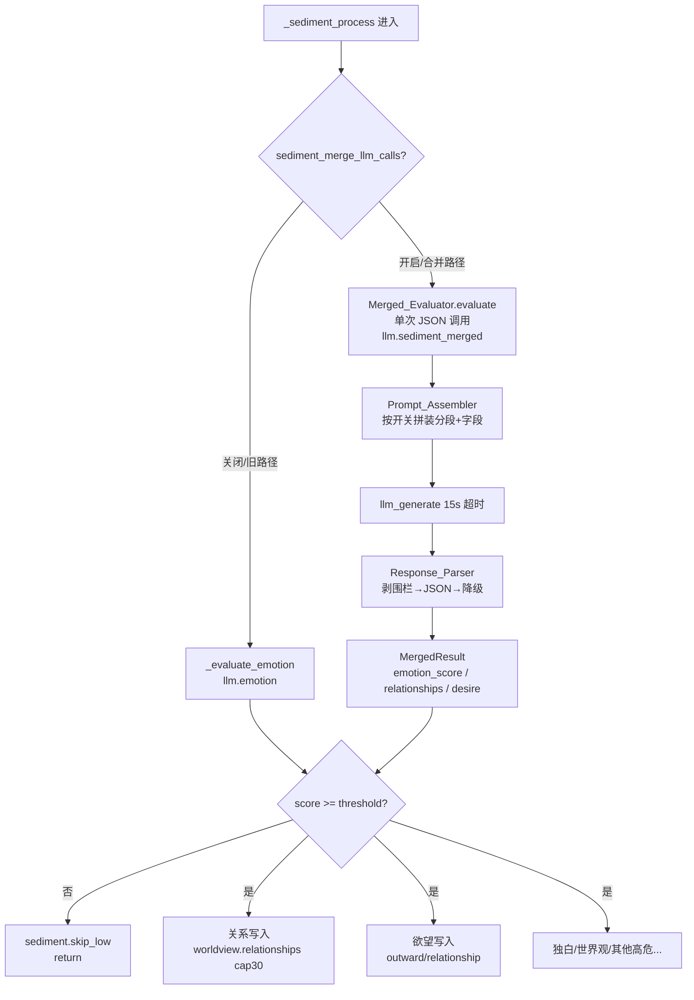

# 设计文档

## Overview

本设计把沉淀流程（`_sediment_process`，位于 `anima/mixins/sediment.py`）中当前**串行发起的三次独立内部 LLM 调用**——情绪评估（`_evaluate_emotion`）、关系推断（`_danger_relationship_inference`）、欲望生成（`_maybe_generate_desire`）——合并为**一次结构化 JSON 内部 LLM 调用**，目标是把这一段的内部调用 token 成本降低约 2/3。

设计的核心是新增一个 **合并评估器（Merged_Evaluator）**，由两个纯逻辑子组件支撑：

- **提示词组装器（Prompt_Assembler）**：按各子任务的开关与前置条件，条件化拼装提示词分段与"请求字段清单"。被关闭的子任务既不进提示词，也不进请求字段，从而真正省 token。
- **响应解析器（Response_Parser）**：把 LLM 返回的 JSON 文本解析为结构化结果（情绪分 / 关系映射 / 欲望），并在解析失败时执行**逐级降级**，保证最关键的沉淀总闸（情绪分）不被一次格式错误击穿。

合并后，三类结果分别流回**既有的下游消费者**，行为契约保持不变：

- 情绪分 → 伤痕放大 → `last_emotion_score` 持久化 → `emotion_threshold` 门控；
- 关系映射 → `_is_rejected` 过滤 → `worldview.json` 的 `relationships`（上限 30 条）；
- 欲望 → `_is_rejected` / 长度 / `_is_desire_already_expressed` 过滤 → 写入 `kind="outward"`、`source="relationship"` 的欲望字典。

该改动触及核心沉淀链，是本项目**风险最高**的一次改动。为此引入特性开关 `sediment_merge_llm_calls`（默认 `false`），在"合并路径"与"旧的三次分离调用路径（Legacy_Path）"之间切换，既能借助 v0.9.1 仪表盘做 A/B token 对比，又能在出问题时一键回退到旧路径。

### 设计原则

1. **下游零改动**：合并只改"如何取得三类结果"，不改"取得后怎么用"。情绪分门控、伤痕逻辑、世界观写入与裁剪、欲望去重与字典写入，全部复用既有方法（`_get_scar_multiplier`、`_atomic_update_state`、`_read_worldview`/`_write_worldview`、`_is_rejected`、`_is_desire_already_expressed`、`_write_desires`）。
2. **纯逻辑可测**：提示词组装与响应解析被拆成不调用 LLM 的纯函数，便于属性测试覆盖所有开关组合与降级路径。
3. **降级不反噬节省**：解析失败时**绝不**回退去重新发起旧路径的三次调用，否则一次失败反而比旧路径更费 token。降级只在已拿到的单次响应文本上做最佳努力提取。
4. **可逆**：默认走旧路径；开关关闭即完全恢复 v0.9.1 行为与埋点。

## Architecture

### 沉淀链中的位置

合并只替换沉淀链中"评估情绪 / 关系推断 / 欲望生成"这三段所对应的 LLM 调用，链上其余步骤（记忆存储、独白生成、世界观更新、矛盾检测、其他高危功能等）保持原顺序与原实现。

需要注意：在**旧路径**里这三个调用并不相邻——情绪评估在步骤 2，欲望生成在步骤 9，关系推断在步骤 11（`_danger_relationship_inference`）。合并路径把这三类结果在沉淀链早期（情绪评估处）一次性取得，然后在原有的各下游位置消费。这样做的关键约束是：**情绪分仍是总闸**，若情绪分低于阈值则整条链 `return`，此时关系与欲望即便已经从合并响应里拿到也不写入——这与旧路径"低情绪时根本不会跑到步骤 9/11"的副作用形态保持一致。



### 路径切换与下游统一

为保证"两条路径对相同输入产出形态一致的下游副作用"（需求 8.4），设计把**下游消费逻辑抽成与路径无关的统一写入点**：

- 合并路径在情绪评估处调用 `Merged_Evaluator.evaluate(...)`，拿到 `MergedResult`，把 `emotion_score` 交给既有伤痕放大与门控；把 `relationships`、`desire` **暂存**，待情绪分过闸后在原下游位置写入。
- 旧路径维持现状：`_evaluate_emotion` 取情绪分，`_danger_relationship_inference` 与 `_maybe_generate_desire` 各自调用 LLM 并就地写入下游。

两条路径写入下游时调用**同一组下游处理函数**（见 Components 中的 `_apply_relationships_from_map` / `_apply_desire_from_text`），从源头消除"两条路径下游行为漂移"的风险。旧路径的两个原方法重构为"取得文本 → 调用同一下游处理函数"，使下游逻辑单一来源。

### 关键模块与文件

| 模块 | 文件 | 职责 |
| --- | --- | --- |
| `Merged_Evaluator` | `anima/mixins/sediment.py`（新增方法/或新 mixin `merged_eval.py`） | 编排单次合并调用：组装→调用→解析 |
| `Prompt_Assembler` | 同上（纯函数 `_build_merged_prompt`） | 按开关/前置条件拼装提示词分段与字段清单 |
| `Response_Parser` | 同上（纯函数 `_parse_merged_response`） | 剥围栏、JSON 解析、正则降级、字段钳制 |
| 下游统一写入 | `anima/mixins/sediment.py` | `_apply_relationships_from_map`、`_apply_desire_from_text` |
| 配置项 | `_conf_schema.json` | `sediment_merge_llm_calls`（bool，默认 false） |
| 复用 | `emotion.py`/`danger.py`/`desire.py`/`worldview.py`/`stats.py`/`state_io.py` | `_get_provider_id`、`_stat_bump`、`_is_rejected`、`_is_desire_already_expressed`、`_read_worldview`/`_write_worldview` |

## Components and Interfaces

### Merged_Evaluator

合并评估器是编排入口，负责"组装提示词 → 解析 provider → 发起单次 15s 超时调用 → 解析响应 → 统计埋点"。它本身不写下游，只返回结构化结果。

```python
async def _merged_evaluate(
    self,
    event: AstrMessageEvent,
    response_text: str,
    sylanne_state: str,
) -> "MergedResult":
    """单次结构化合并调用，产出情绪分 / 关系映射 / 欲望。
    任意失败路径都返回安全的 MergedResult（emotion_score=0.0，relationships=None，desire=None），
    绝不抛异常、绝不回退旧的三次分离调用。
    """
```

行为契约（对应需求 1）：

- 通过 `await self._get_provider_id(event)` 解析模型 ID（需求 1.2）；返回空串时直接返回 `MergedResult(emotion_score=0.0)`，跳过关系与欲望（需求 1.3）。
- 用 `asyncio.wait_for(self.context.llm_generate(chat_provider_id=provider_id, prompt=prompt), timeout=15.0)`（需求 1.4）；`asyncio.TimeoutError` 时返回 `MergedResult(emotion_score=0.0)`（需求 1.5）。
- 仅在**实际完成一次物理调用后**（拿到 `llm_resp`，无论解析成败）触发 `self._stat_bump("llm.sediment_merged")`（需求 7.1）。provider 为空或超时未发出物理调用时不计数。
- 调用 `Prompt_Assembler` 得到提示词与"请求字段集合 `requested`"，再把 `llm_resp.completion_text` 与 `requested` 一起交给 `Response_Parser`。

### Prompt_Assembler

纯函数，按开关与前置条件拼装提示词与请求字段清单。**不调用 LLM、不读写文件**（前置状态由调用方传入），因此可对所有开关组合做属性测试。

```python
def _build_merged_prompt(
    self,
    event: AstrMessageEvent,
    response_text: str,
    sylanne_state: str,
    *,
    relationship_on: bool,   # danger_relationship_inference and worldview_enabled
    desire_on: bool,         # desire_enabled and bool(sylanne_state)
) -> tuple[str, frozenset[str]]:
    """返回 (合并提示词, 请求字段集合)。
    请求字段集合 requested ⊆ {"emotion_score","relationships","desire"}，
    "emotion_score" 恒在其中。
    """
```

组装规则（对应需求 2）：

- **情绪分段恒在**：提示词总是包含情绪评估说明，`requested` 总是包含 `"emotion_score"`（需求 2.1、2.7）。
- **关系分段**：当且仅当 `danger_relationship_inference` 与 `worldview_enabled` 同时为真时包含关系推断说明，并把 `"relationships"` 加入 `requested`（需求 2.2）；任一为假则两者都省略（需求 2.3）。
- **欲望分段**：当且仅当 `desire_enabled` 为真且 `sylanne_state` 为非空字符串时包含欲望生成说明，并把 `"desire"` 加入 `requested`（需求 2.4）；`desire_enabled` 为假（需求 2.5）或 `sylanne_state` 为空（需求 2.6）则两者都省略。
- **退化为纯情绪**：当关系与欲望分段都被省略时，提示词等价于旧 `_evaluate_emotion` 的语义——要求 LLM 只回一个 JSON，里面只含 `emotion_score`（需求 2.7）。

调用方负责计算 `relationship_on` / `desire_on` 这两个布尔（把"读配置/读 sylanne_state"的副作用留在 `Merged_Evaluator` 编排层），保持 `Prompt_Assembler` 为纯函数便于测试。

提示词中会明确要求："只返回一个 JSON 对象，不要任何额外文字"，并按 `requested` 动态列出字段说明与 JSON 骨架示例（需求 1.6）：

- `emotion_score`：0–1 浮点数（沿用旧情绪 prompt 的语义说明：0=平淡闲聊，1=极强情绪）。
- `relationships`（仅请求时）：`{"uid1 -> uid2": "关系描述"}`，无法推断回 `{}`。
- `desire`（仅请求时）：一句欲望描述字符串；没有则 `"无"` 或 `null`。

### Response_Parser

纯函数，输入"原始响应文本 + 请求字段集合"，输出 `MergedResult`。**不调用 LLM**，可对解析/降级路径做属性测试。

```python
def _parse_merged_response(
    self,
    text: str,
    requested: frozenset[str],
) -> "MergedResult":
    """剥围栏 → JSON 解析 → 字段钳制；失败逐级降级。"""
```

解析与降级（对应需求 3）：

1. **剥 Markdown 围栏**：用与既有 `_danger_relationship_inference` 一致的正则先剥前导 ```` ```json ```` / ```` ``` ````、结尾 ```` ``` ````，再解析（需求 3.1）：
   ```python
   text = re.sub(r'^```(?:json)?\s*', '', text.strip())
   text = re.sub(r'\s*```$', '', text)
   ```
2. **JSON 解析成功**：
   - `emotion_score` 存在且为数字 → 钳制到 `[0.0, 1.0]` 作为情绪分（需求 3.2）。
   - `emotion_score` 缺失或非数字 → 情绪分 0.0（需求 3.5），但**仍按 requested 解析** `relationships` / `desire`（缺失字段按"未产出"处理）。
   - `relationships`：仅当 `"relationships" in requested` 且值为非空 `dict` 时填入；否则为 `None`（需求 4 段交由下游，缺失/非映射即跳过，见需求 5.4）。
   - `desire`：仅当 `"desire" in requested` 时取字符串值（`null` 视为无）。
3. **JSON 解析失败**：以最佳努力正则从原始文本提取**首个 0–1 之间的数字**作为情绪分，并把 `relationships`、`desire` 置为 `None`（跳过本轮关系与欲望，需求 3.3）。正则示例：`re.search(r'(?<![\d.])(0?\.\d+|0|1(?:\.0+)?)(?![\d.])', text)`，匹配后再钳制到 `[0,1]`。
4. **解析失败且正则提不到有效情绪分**：情绪分 0.0，关系与欲望均 `None`（需求 3.4）。

`Response_Parser` 与 `Merged_Evaluator` 都**不触发**旧路径的三次分离调用（需求 3.6、6 段在调用层保证）。

### 下游统一写入函数

把关系与欲望的下游处理抽成与路径无关的函数，供合并路径与重构后的旧路径共用，保证副作用形态一致（需求 8.4）。

```python
def _apply_relationships_from_map(self, relations: object) -> None:
    """把关系映射写入 worldview.relationships（含 _is_rejected 过滤与 cap 30）。
    relations 非 dict 或为空时静默跳过（需求 5.4）。"""

async def _apply_desire_from_text(
    self, desire_text: object, response_text: str, event: AstrMessageEvent
) -> None:
    """把欲望文本经既有过滤后写入欲望队列（需求 6.1–6.5）。"""
```

`_apply_relationships_from_map`（对应需求 5）：

- 入参非 `dict` 或为空 → 直接返回，不抛异常（需求 5.4）。
- 对关系文本（这里复用既有做法：对 JSON 文本/拼接文本）应用 `self._is_rejected(...)`，命中拒答 → 丢弃整个映射（需求 5.1）。
- 读 `wv = self._read_worldview()`，确保 `wv["relationships"]` 存在，`update(relations)`（需求 5.2），超过 30 条时 `dict(list(...)[-30:])` 截断（需求 5.3），再 `self._write_worldview(wv)`。

`_apply_desire_from_text`（对应需求 6）：

- `desire_text` 为 `None` / 空串 / `"无"` / 长度 ≤ 2 → 不创建（需求 6.2）。
- 先 `self._is_rejected(desire_text)`，命中 → 丢弃（需求 6.1）。
- 读队列，若长度已达 `desire_max_queue` → 不写（需求 6.5）。
- `await self._is_desire_already_expressed(desire_text, response_text, event)` 为真 → 跳过写入（需求 6.3）。
- 通过全部过滤 → 追加欲望字典（字段见 Data Models，需求 6.4），写回，并 `self._stat_bump("desire.created.outward")`（需求 7.3）。

旧路径重构：`_maybe_generate_desire` 改为取得 `result` 文本后调用 `_apply_desire_from_text(...)`；`_danger_relationship_inference` 改为解析出 `relations` 后调用 `_apply_relationships_from_map(...)`，二者各自保留**自己的** `_stat_bump("llm.relation")` / LLM 调用（旧路径埋点不变，需求 7.4），但下游写入走统一函数。

### 沉淀流程编排（_sediment_process 改动）

```python
if self.config.get("sediment_merge_llm_calls", False):
    # 合并路径：在情绪评估处一次取得三类结果
    sylanne_state = await self._try_read_sylanne_state(event)   # 欲望前置条件
    merged = await self._merged_evaluate(event, response_text, sylanne_state)
    score = merged.emotion_score
    self._stat_bump("llm.sediment_merged")  # 实际在 _merged_evaluate 内部按"已发出物理调用"触发
    # ...伤痕放大、last_emotion_score、阈值门控（与旧路径同一段代码）...
    if score < threshold:
        self._stat_bump("sediment.skip_low")
        return
    # 过闸后，在原下游位置写入暂存的关系与欲望
    self._apply_relationships_from_map(merged.relationships)
    await self._apply_desire_from_text(merged.desire, response_text, event)
    # 关系推断/欲望生成的 LLM 调用已被合并，旧的 _danger_relationship_inference /
    # _maybe_generate_desire 在合并路径下不再发起 LLM 调用
else:
    # 旧路径：保持现状
    score = await self._evaluate_emotion(event, response_text)
    self._stat_bump("llm.emotion")
    # ...门控...；下游仍由 _maybe_generate_desire / _danger_relationship_inference 触发
```

> 实现要点：合并路径下，沉淀链后段不再调用 `_danger_relationship_inference`、`_maybe_generate_desire` 的 LLM 部分（避免重复物理调用与 `llm.relation` 重复计数，需求 7.2）。其余高危功能（`_danger_stance_propagation`、`_danger_core_mutation` 等）与独白、世界观更新保持不变。`sylanne_state` 仍按既有方式读取并用于 `_danger_identity_crisis_update`。

## Data Models

### MergedResult

合并评估器的返回结构。用轻量 `dataclass` 或普通 `dict`；下面以 dataclass 表达字段契约。

```python
@dataclass
class MergedResult:
    emotion_score: float = 0.0          # 已钳制到 [0.0, 1.0]
    relationships: Optional[dict] = None  # None=未产出/跳过；dict=待写入映射
    desire: Optional[str] = None        # None=未产出/跳过；str=待过滤的欲望文本
```

- `emotion_score`：恒为 `[0.0, 1.0]` 内的浮点数；任何失败路径回退 0.0。
- `relationships`：`None` 表示"本轮不写关系"（未请求、字段缺失、非映射、JSON 解析失败降级）；`dict` 表示候选映射（可能为空 dict，下游对空 dict 视为无写入）。
- `desire`：`None` 表示"本轮不产欲望"；`str` 表示候选欲望文本（仍需经下游过滤）。

### 合并调用的 JSON 输出契约

LLM 被要求返回单个 JSON 对象（需求 1.6），字段按 `requested` 动态出现：

```jsonc
{
  "emotion_score": 0.42,                       // 恒在
  "relationships": {"u1 -> u2": "同事"},        // 仅当请求关系时
  "desire": "想问问对方周末去哪了"               // 仅当请求欲望时；无则 "无" 或 null
}
```

### 欲望字典（写入形态，需求 6.4）

与旧 `_maybe_generate_desire` 完全一致：

```python
{
    "id": f"desire_{int(time.time())}",
    "content": desire_text,
    "source": "relationship",
    "kind": "outward",
    "intensity": 0.7,
    "created_at": datetime.now().isoformat(),
    "target_user": sender_id,   # 从 event.message_obj.sender.user_id 取，失败为 ""
    "target_umo": self._get_event_umo(event),
    "satisfied": False,
}
```

### 世界观关系（写入形态，需求 5.2/5.3）

`worldview.json` 的 `relationships` 字段，键为 `"uid -> uid"`，值为关系描述字符串；`update` 合并后保留最近 30 条。

### 配置项（需求 8.1）

新增到 `_conf_schema.json`：

```jsonc
"sediment_merge_llm_calls": {
  "description": "合并沉淀流程的三次内部 LLM 调用（情绪/关系/欲望）为一次结构化 JSON 调用",
  "type": "bool",
  "default": false,
  "hint": "💡 省 token 杠杆：开启后沉淀链把情绪评估+关系推断+欲望生成合并为单次调用，约省 2/3 内部 token。默认关闭（走旧的分离调用路径以降低风险），可配合 /anima_stats 仪表盘做 A/B 对比。统计计入 llm.sediment_merged"
}
```

### 统计计数项（需求 7）

| key | 触发时机 | 路径 |
| --- | --- | --- |
| `llm.sediment_merged` | 合并路径实际完成一次物理 LLM 调用 | 仅合并 |
| `desire.created.outward` | 一条欲望被成功写入 | 两条路径 |
| `llm.emotion` / `llm.relation` | 旧路径各自的物理调用 | 仅旧路径（合并路径**不**触发，需求 7.2） |

所有埋点继续受 `dashboard_enabled` 总开关约束——关闭时 `_stat_bump` 自身跳过累加（需求 7.5），无需在本特性额外处理。

## Correctness Properties

*属性（property）是一种在系统所有合法执行中都应当成立的特征或行为——本质上是关于"系统应当做什么"的形式化陈述。属性在人类可读的规格说明与机器可验证的正确性保证之间架起桥梁。*

下列属性由验收标准的 prework 分析归并而来（消除了逻辑冗余）。每条属性都是全称量化陈述，可用属性测试库覆盖；对应的多条验收标准已合并为单条更全面的属性。本特性的纯逻辑核心（条件化提示词组装、JSON 解析与降级、下游写入不变量）非常适合属性测试。

### Property 1: 单次物理调用纪律

*对任意*开关组合（情绪恒在、关系开/关、欲望开/关）与任意响应/超时/空 provider 场景，合并路径**至多发起一次** `llm_generate` 物理调用，**绝不**再调用旧路径三个方法的 LLM 部分；当且仅当物理调用实际完成时恰好触发一次 `llm.sediment_merged`，且**永不**触发 `llm.emotion` 或 `llm.relation`；当 `_get_provider_id` 返回空串或调用超时时，返回安全结果 `MergedResult(emotion_score=0.0, relationships=None, desire=None)` 且不发起物理调用。

**Validates: Requirements 1.1, 1.3, 1.5, 3.6, 7.1, 7.2**

### Property 2: 提示词与请求字段的条件化组装

*对任意*开关组合与任意 `sylanne_state`（含空串、纯空白、非空），`Prompt_Assembler` 产出的请求字段集合 `requested` 满足：`"emotion_score"` 恒在其中；`"relationships" in requested` 当且仅当 `danger_relationship_inference` 与 `worldview_enabled` 同时为真；`"desire" in requested` 当且仅当 `desire_enabled` 为真且 `sylanne_state` 为非空字符串；当关系与欲望均不被请求时 `requested == {"emotion_score"}` 且提示词不提及关系与欲望（退化为纯情绪评估）。提示词文本要求返回单个 JSON 对象，且仅描述 `requested` 中的字段。

**Validates: Requirements 1.6, 2.1, 2.2, 2.3, 2.4, 2.5, 2.6, 2.7**

### Property 3: 成功解析的围栏剥离、钳制与往返

*对任意*合法结果对象（含任意数值的 `emotion_score`，以及按 `requested` 出现的 `relationships` 映射与 `desire` 字符串）编码为 JSON 文本后——无论是否被 ```` ```json ```` / ```` ``` ```` 代码围栏包裹——`Response_Parser` 解析得到的情绪分等于 `clamp(value, 0.0, 1.0)`（当 `emotion_score` 缺失或非数字时为 `0.0`）且恒落在 `[0.0, 1.0]`，并正确还原 `requested` 中的 `relationships` 与 `desire`。

**Validates: Requirements 3.1, 3.2, 3.5**

### Property 4: 非法 JSON 的降级提取

*对任意*无法被 JSON 解析的文本，`Response_Parser` 以正则提取其中**首个** 0–1 之间的数字（钳制后）作为情绪分；若文本中不存在可提取的 0–1 数字则情绪分为 `0.0`；两种情形下 `relationships` 与 `desire` 均为 `None`（跳过本轮关系与欲望产出）。

**Validates: Requirements 3.3, 3.4**

### Property 5: 情绪阈值门控

*对任意*经伤痕放大后的情绪分，若其小于配置 `emotion_threshold`，则沉淀流程触发一次 `_stat_bump("sediment.skip_low")` 并提前返回，不发生任何关系写入或欲望写入等后续下游副作用。

**Validates: Requirements 4.3**

### Property 6: 世界观关系写入与上限不变量

*对任意*既有 `relationships` 字典与任意候选映射，`_apply_relationships_from_map` 满足：候选为 `None`、非 `dict`、空 `dict` 或其文本命中 `_is_rejected` 时，世界观 `relationships` 保持不变；否则候选条目以 `update` 语义并入，写入后 `len(relationships) <= 30`（超出时保留最近 30 条）；任何情形都不抛出异常。

**Validates: Requirements 5.1, 5.2, 5.3, 5.4**

### Property 7: 欲望写入的过滤与字典形态

*对任意*候选欲望文本、任意欲望队列状态与任意去重判定结果，`_apply_desire_from_text` 当且仅当满足全部条件——未命中 `_is_rejected`、非退化值（非 `None`/空串/`"无"`/长度 > 2）、`_is_desire_already_expressed` 判定为否、且队列长度小于 `desire_max_queue`——时写入一条欲望字典并恰好触发一次 `_stat_bump("desire.created.outward")`；写入的字典字段恒为 `source="relationship"`、`kind="outward"`、`intensity=0.7`、`satisfied=False`、`content` 等于候选文本、`created_at` 为 ISO 时间戳、含 `id`/`target_user`/`target_umo`；不满足任一条件时不写入且不触发该埋点。

**Validates: Requirements 6.1, 6.2, 6.3, 6.4, 6.5, 7.3**

### Property 8: 新旧路径下游等价

*对任意*逻辑结果三元组（情绪分、关系映射、欲望文本），用相同三元组分别驱动旧路径（三次分离调用产出）与合并路径（单次调用产出）时，二者对下游产生**形态一致**的副作用：持久化的 `last_emotion_score` 相同、`worldview.json` 的 `relationships` 写入结果相同、欲望队列写入结果相同；两条路径的差异**仅限于**内部 LLM 物理调用次数与对应的统计计数项（`llm.sediment_merged` vs `llm.emotion`+`llm.relation`）。

**Validates: Requirements 8.4**

## Error Handling

合并触及核心沉淀链，错误处理以"绝不击穿总闸、绝不抛断主流程、绝不反噬 token 节省"为准则。

| 失败场景 | 处理策略 | 对应需求 |
| --- | --- | --- |
| `_get_provider_id` 返回空串 | 返回 `MergedResult(0.0, None, None)`，不发起物理调用 | 1.3 |
| 合并调用超时（>15s `asyncio.TimeoutError`） | 返回 `MergedResult(0.0, None, None)`，不重试、不回退旧路径 | 1.5, 3.6 |
| `llm_generate` 抛出其他异常 | 捕获并降级为 `MergedResult(0.0, None, None)`；`_sediment_process` 外层 `try/except` 仍兜底 | 3.6 |
| 响应含 Markdown 围栏 | 解析前剥离围栏再 `json.loads` | 3.1 |
| JSON 解析失败 | 正则提取首个 0–1 数字作情绪分；关系/欲望置 `None` | 3.3 |
| JSON 失败且无可提取数字 | 情绪分 `0.0`；关系/欲望 `None` | 3.4 |
| JSON 成功但缺 `emotion_score`/非数字 | 情绪分 `0.0`，仍尝试解析 `requested` 中其他字段 | 3.5 |
| `relationships` 缺失/非映射 | 跳过世界观写入，不抛异常 | 5.4 |
| `desire` 退化值或命中过滤 | 不创建欲望，不抛异常 | 6.1, 6.2, 6.3 |
| 埋点失败（`_stat_bump`） | 既有实现内部吞异常，绝不影响主流程 | 7.5 |

关键约束：**任何降级都不得重新发起旧路径的三次分离调用**（需求 3.6）。降级只在已取得的单次响应文本（或超时/空 provider 的早退）上做最佳努力，确保失败时的 token 成本不超过一次调用。

## Testing Strategy

本特性的核心是纯逻辑（条件化提示词组装、JSON 解析与降级、下游写入不变量、路径等价），**适合属性测试（PBT）**。配置项本身（需求 8.1）与既有 `_stat_bump` 门控（需求 7.5）用 smoke/示例测试，外部 LLM 行为用 mock 驱动，无需对真实 provider 做属性测试。

### 双重测试方法

- **单元/示例测试**：覆盖具体路由与集成点——开关 true/false 路由（8.2/8.3）、`_get_provider_id` 接线（1.2）、15s 超时参数（1.4）、伤痕放大与高情绪 `_add_scar` 衔接（4.1/4.2/4.4）、旧路径埋点不变（7.4）、配置 schema 存在性（8.1）、`dashboard_enabled` 关闭跳过累加（7.5）、既有 190 测试全绿（9.1）。
- **属性测试**：覆盖上述 8 条 Correctness Properties 的全称不变量，通过随机化输入暴露边界（开关组合、空白/超长 `sylanne_state`、越界/缺失情绪分、围栏变体、非法 JSON 噪声、关系映射边界条数、欲望退化值与队列容量、路径等价三元组）。

### 属性测试库与配置

- 选用 **Hypothesis**（Python 标准 PBT 库），加入测试依赖（`requirements.txt` 或测试可选依赖）；**不自行实现属性测试框架**。
- 每条属性测试至少运行 **100 次迭代**（`@settings(max_examples=100)`）。
- 每条属性测试用注释标注其设计属性，标签格式：
  `# Feature: merge-sediment-llm-calls, Property {number}: {property_text}`
- 每条 Correctness Property 用**单个**属性测试实现。

### 测试基础设施（沿用现有约定）

沿用 `tests/conftest.py` 与既有测试（如 `test_v090_stats.py`）的做法：用 `types.ModuleType` 桩掉 `astrbot.*`，构造**最小宿主类**混入目标 mixin，并用内存 `dict` 模拟 `anima_state.json` / `worldview.json` / `desires`。LLM 通过可计数、可定制返回值的异步 mock 注入 `self.context.llm_generate`，从而：

- 统计物理调用次数（Property 1、8）；
- 注入任意（含非法）响应文本驱动解析与降级（Property 3、4）；
- 让旧路径与合并路径产出"等价三元组"以比对下游（Property 8）。

`_is_desire_already_expressed`、`_get_scar_multiplier`、`_get_provider_id` 等依赖在宿主桩中按需 stub 为可控返回值，使属性测试聚焦被测纯逻辑。

### 属性到测试映射

| 属性 | 测试焦点 | 关键生成器 |
| --- | --- | --- |
| P1 单次调用纪律 | 物理调用计数、埋点、安全降级 | 开关组合 × {正常响应, 超时, 空 provider} |
| P2 提示词组装 | `requested` 双条件、退化纯情绪 | 三布尔开关 × sylanne_state(空/空白/非空) |
| P3 成功解析往返 | 围栏剥离 + 钳制 + 字段还原 | 任意结果对象 × 围栏变体 × 越界/缺失分值 |
| P4 非法 JSON 降级 | 首个 0–1 数字提取 / 兜底 0.0 | 噪声文本（含/不含可提取数字） |
| P5 阈值门控 | skip_low 埋点 + 早退无下游副作用 | 任意 score < / ≥ threshold |
| P6 世界观写入 | 拒答/None/非映射跳过；update+cap30 | 既有 dict × 候选映射（含拒答/非法类型/超 30 条） |
| P7 欲望写入 | 过滤合取 + 字典形态 + 埋点 | 候选文本（含退化值）× 队列长度 × 去重结果 |
| P8 路径等价 | 下游副作用形态一致 | 任意 (score, relations, desire) 三元组 |

### 回归安全（需求 9）

- **9.1**：先跑既有 190 测试确保全绿（默认 `sediment_merge_llm_calls=false`，旧路径行为零改动是回归基线）。
- **9.2**：由 P2 覆盖各开关组合（情绪-only、情绪+关系、情绪+欲望、情绪+关系+欲望）。
- **9.3**：由 P3、P4 覆盖解析成功 / 正则降级 / 无法提取三条路径。
- **9.4**：由 P5、P6、P7、P8 覆盖三类结果正确流入下游。
- **9.5**：由旧路径示例测试覆盖（7.4、8.3）——开关关闭时三次分离调用与既有埋点不变。
- 旧路径方法（`_maybe_generate_desire`、`_danger_relationship_inference`）重构为复用统一下游写入函数后，需以既有/新增示例测试确认其外部行为与重构前一致。
