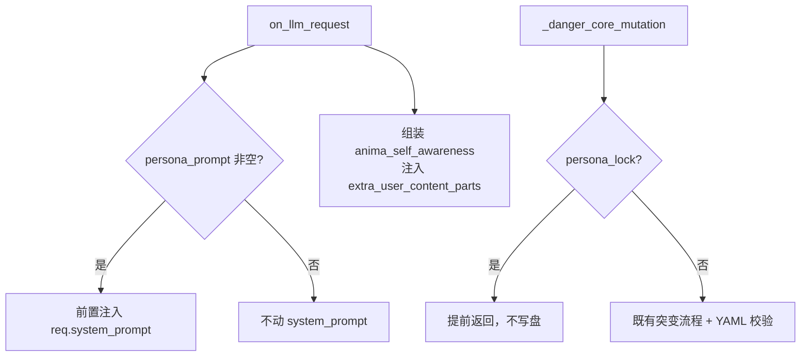

# 设计文档

## Overview

v0.9.7 补齐"角色人设传入"。两个功能点 + 文档：

1. **`persona_prompt` 注入 system prompt**：在 `on_llm_request` 里把用户配置的人设文本前置到 `req.system_prompt`（`ProviderRequest.system_prompt: str` 是可写字段，已确认）。与既有 `<anima_self_awareness>` 用户消息块**互不影响、可并存**。
2. **`persona_lock` 锁定**：开启后 `_danger_core_mutation` 提前返回，不写 `persona_core.yaml`。
3. **文档**：README 加三层人设分工表。

改动极小、低风险：`main.py`（注入 + 配置读取）、`danger.py`（锁定判断）、`_conf_schema.json`（2 配置项）、README/CHANGELOG。

## Architecture



人设三层（注入位置）：

| 层 | 来源 | 注入位置 | 谁能改 |
| --- | --- | --- | --- |
| 框架 system prompt | AstrBot 角色配置 | system | 用户 |
| `persona_prompt` | Anima 配置 | **system（v0.9.7 新增）** | 用户 |
| `persona_core.yaml` | Anima 文件 | 用户消息块 | 用户 / Core_Mutation（受 persona_lock） |
| `seed_persona` | Anima 配置 | 一次性写入 self_notes | 用户（仅初始） |

## Components and Interfaces

### R1: persona_prompt 注入 system prompt（main.py on_llm_request）

在 `on_llm_request` 早段（`enabled` 检查后、组装 Self_Awareness_Block 之前或之后均可，独立）加入：

```python
# v0.9.7: 人设 prompt 注入 system prompt（最高权重，独立于用户消息块）
persona_prompt = (self.config.get("persona_prompt", "") or "").strip()
if persona_prompt:
    existing_sys = getattr(req, "system_prompt", "") or ""
    if persona_prompt not in existing_sys:   # 防重复注入（同一 req 多 hook 场景）
        req.system_prompt = persona_prompt + ("\n\n" + existing_sys if existing_sys else "")
```

要点：
- 前置（人设在前，框架原 system 在后），换行分隔。
- 幂等保护：若 `persona_prompt` 已在 system_prompt 中则不重复加（避免框架重试/多次进 hook 叠加）。
- 空则完全不碰 `req.system_prompt`。
- 与 `req.extra_user_content_parts.append(...)`（Self_Awareness_Block）并存，互不干扰。

### R2: persona_lock（danger.py _danger_core_mutation）

在 `_danger_core_mutation` 现有开关检查后加一道：

```python
if not self.config.get("danger_core_mutation", False):
    return
if not self.config.get("danger_core_mutation_confirm", False):
    return
# v0.9.7: 人设锁定 —— 用户锁死人设时，核心突变不写盘
if self.config.get("persona_lock", False):
    if not getattr(self, "_warned_persona_lock", False):
        self._warned_persona_lock = True
        logger.info("[DANGER][Anima] persona_lock 已开启，核心突变被禁止写入 persona_core.yaml")
    return
```

> 放在 confirm 检查之后、`_sediment_count % 100` 检查之前/之后均可（提前返回即可）。一次性日志用实例标志位防刷屏。其它演化机制（情绪/欲望/世界观）不受影响，因为它们不在此函数内。

### R3: 文档（README）

新增"角色人设：三层配置"小节，含上方分工表 + 注入位置说明 + `persona_lock` 与 `danger_core_mutation` 的关系。

## Data Models

无新增数据结构。

### 配置项（_conf_schema.json 新增）

放在 `seed_persona` 附近（人设相关聚类）：

```jsonc
"persona_prompt": {
  "description": "角色人设 Prompt（注入到 system prompt，最高权重）",
  "type": "text",
  "default": "",
  "hint": "🟡 Token 中（增加每轮 system prompt 的输入 token，内容越长越费）。v0.9.7：在此直接写角色人设（名字/性格/说话风格/背景），会被注入到 system prompt 最前面。留空则不注入。与 AstrBot 角色配置的 system prompt 叠加（本项在前）"
},
"persona_lock": {
  "description": "锁定核心人设（禁止自我演化改写 persona_core.yaml）",
  "type": "bool",
  "default": false,
  "hint": "⚪ Token 无。v0.9.7：开启后 danger_core_mutation 不再改写 persona_core.yaml，你写死的核心人设不会被角色自我演化覆盖。情绪/欲望/世界观等其它演化不受影响"
}
```

## Correctness Properties

### Property 1: persona_prompt 注入语义
*对任意* persona_prompt 与既有 system_prompt：非空时注入后 `req.system_prompt` 以 persona_prompt 开头且包含原 system_prompt；空时 `req.system_prompt` 不变；重复进入注入逻辑不产生重复叠加（幂等）。
**Validates: Requirements 1.2, 1.3, 1.4**

### Property 2: persona_lock 阻止写盘
*对任意* 配置：当 persona_lock=true 时 `_danger_core_mutation` 在任何 LLM 调用/写盘前返回；persona_lock=false 时不因本特性提前返回。
**Validates: Requirements 2.2, 2.4**

## Error Handling

| 场景 | 策略 | 需求 |
| --- | --- | --- |
| req 无 system_prompt 属性（旧框架） | `getattr(req, "system_prompt", "")` 兜底；若不可写则 try 包裹 | 1.2 |
| persona_prompt 含异常字符 | 作为纯字符串拼接，无解析风险 | 1.2 |
| persona_lock 读取异常 | `.get` 默认 false，不影响既有突变 | 2.2 |

## Testing Strategy

- **属性测试（Hypothesis，≥100 迭代）**：Property 1（注入语义 + 幂等）、Property 2（锁定阻断）。
- **示例测试**：persona_prompt 非空注入 / 空不注入 / 已存在不重复；persona_lock=true 阻断 core_mutation、=false 不阻断；配置项存在性。
- **回归**：既有 273 测试全过；默认（persona_prompt 空 + persona_lock false）行为不变。
- 测试沿用现有桩约定；core_mutation 锁定测试用 `_danger_host` 风格最小宿主，断言开启 lock 时函数提前返回（不调用任何 LLM mock）。
