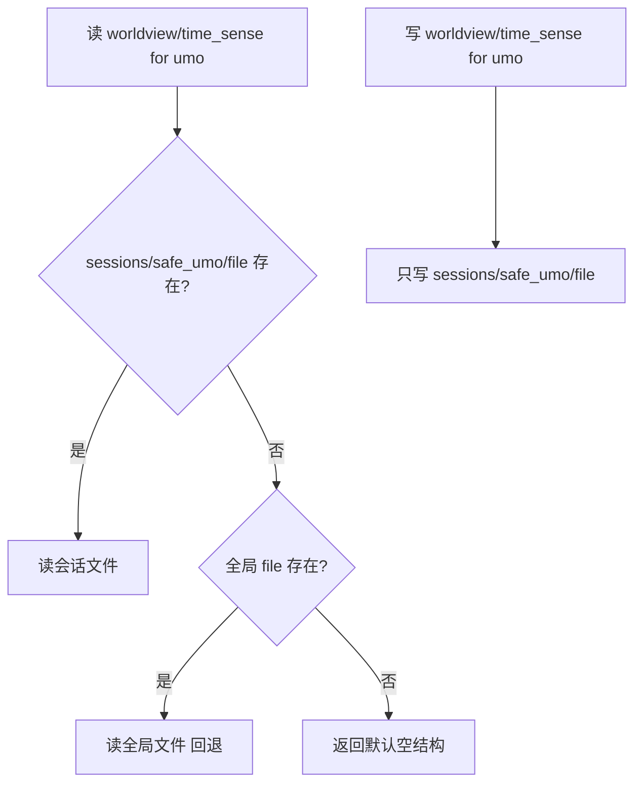

# 设计文档

## Overview

按方案 1 实现会话级隔离：**角色本体人格全局共享，会话上下文（worldview + time_sense）按 umo 隔离**。

核心机制：**per-umo 子目录 + 全局回退**。
- 每个 umo 的会话状态存到 `data_dir/sessions/<safe_umo>/worldview.json`、`.../time_sense.json`。
- 读取时：会话文件存在 → 读会话文件；不存在 → 回退读旧全局文件（向后兼容，老数据不丢）。
- 写入时：只写会话文件，不动全局文件（全局文件作为只读回退源保留）。

最小侵入：只把 `_read_worldview/_write_worldview/_read_time_sense/_write_time_sense` 四个函数改成接受可选 umo 参数，并在各调用点传入 umo。无 event 的后台路径回退到 `_last_active_umo` → `_default_`。A 类人格状态的读写函数完全不动。

## Architecture



目录结构（改造后）：

```
data/plugin_data/astrbot_plugin_anima/
├── self_notes.md            ← A 类，全局不动
├── persona_core.yaml        ← A 类
├── scar_dimensions.json     ← A 类
├── personal_capabilities.json ← A 类
├── anima_state.json         ← A 类（含 personality_vector 等）
├── desires.json             ← 字段级 umo，不动
├── worldview.json           ← 旧全局，保留作回退源
├── time_sense.json          ← 旧全局，保留作回退源
└── sessions/
    ├── <safe_umo_A>/
    │   ├── worldview.json    ← A 群独立
    │   └── time_sense.json
    └── <safe_umo_B>/
        ├── worldview.json    ← B 群独立
        └── time_sense.json
```

## Components and Interfaces

### R1: 会话目录派生（state_io.py 新增）

```python
import re, hashlib

def _safe_umo(self, umo: str) -> str:
    """把 umo 转成安全目录名。空→_default_；防路径穿越；碰撞用哈希后缀消歧。"""
    if not umo:
        return "_default_"
    safe = re.sub(r'[^A-Za-z0-9_-]', '_', umo)
    safe = safe.strip('_') or "_default_"
    # 不同原始 umo 经替换后可能碰撞 → 附加短哈希保唯一
    h = hashlib.md5(umo.encode("utf-8")).hexdigest()[:8]
    return f"{safe[:40]}_{h}"

def _session_dir(self, umo: str) -> str:
    d = os.path.join(self.data_dir, "sessions", self._safe_umo(umo))
    try:
        os.makedirs(d, exist_ok=True)
    except OSError:
        pass
    return d

def _session_path(self, umo: str, filename: str) -> str:
    return os.path.join(self._session_dir(umo), filename)
```

> 安全化策略：先把非 `[A-Za-z0-9_-]` 字符替换为 `_`，再附加原始 umo 的 md5 前 8 位。这样既可读（保留可识别前缀）又唯一（哈希消歧），且天然防路径穿越（`..`/`/` 都被替换）。

### R2/R3: worldview & time_sense 读写改造

`worldview.py`：

```python
def _read_worldview(self, umo: str = "") -> dict:
    return self._read_session_json(umo, "worldview.json", self.worldview_path, default={})

def _write_worldview(self, data: dict, umo: str = ""):
    self._write_session_json(umo, "worldview.json", data)
```

`time_sense.py` 同理（`_read_time_sense(umo="")` / `_write_time_sense(data, umo="")`，default 用既有结构）。

新增统一的会话 JSON 读写助手（state_io.py）：

```python
def _read_session_json(self, umo, filename, global_path, default):
    """读会话文件；不存在则回退全局文件；都没有返回 default。"""
    sp = self._session_path(umo, filename)
    if os.path.exists(sp):
        return self._read_json(sp, default=default)
    # 全局回退（向后兼容老数据）
    if global_path and os.path.exists(global_path):
        return self._read_json(global_path, default=default)
    return default() if callable(default) else (default if default is not None else {})

def _write_session_json(self, umo, filename, data):
    """只写会话文件（持锁，复用 _write_json）。"""
    self._write_json(self._session_path(umo, filename), data)
```

> default 传可调用或值都支持（time_sense 的 default 是带默认字段的 dict，worldview 是 `{}`）。

### 调用点改造（传 umo）

| 文件 | 方法 | umo 来源 |
| --- | --- | --- |
| worldview.py | `_maybe_update_worldview(event)` 内读写 | `_get_event_umo(event)` |
| worldview.py | `_get_worldview_text(event)` 内读 | `_get_event_umo(event)` |
| merged_eval.py | `_apply_relationships_from_map(relations, umo)` | 新增 umo 参数，由 sediment.py 调用处传入 `_get_event_umo(event)` |
| danger.py | `_danger_relationship_inference(event,...)` 内（经 `_apply_relationships_from_map`） | event |
| danger.py | `_danger_autonomous_web` 的 external_knowledge 读写 | `_get_event_umo(event)` |
| relations.py | `_propagate_cross_relation_scar(low_uid, umo="")` | **Eventless**：新增 umo 参数，由 `_update_user_low_emotion_streak` 调用处传入；该函数本身在 sediment.py 有 event，透传下来 |
| time_sense.py | `_update_time_sense(event)` / `_get_time_sense_text(event)` | event |

> **关键：Eventless 路径处理**。`_propagate_cross_relation_scar` 经 `asyncio.create_task` 调用，但触发它的 `_update_user_low_emotion_streak(uid, score)` 也无 event（在 sediment.py 被调用时有 event）。设计：给这两个函数加 umo 参数层层透传；sediment.py 调用 `_update_user_low_emotion_streak` 处传入 `_get_event_umo(event)`。若某路径确实拿不到 umo，回退 `self._last_active_umo`，再不行用 `_default_`。

`_apply_relationships_from_map` 与 `_propagate_cross_relation_scar` 的 umo 参数默认空，空时内部回退 `_last_active_umo`：

```python
def _resolve_umo(self, umo=""):
    return umo or getattr(self, "_last_active_umo", "") or ""
```

### R4: 角色本体状态不动

`_read_self_notes/_write_self_notes/_append_self_notes`、persona_core 裸 open、`_read_scar_dimensions/_write_scar_dimensions`、`_get_personality_vector/_save_personality_vector`、`_read_personal_capabilities/_write_personal_capabilities`、`anima_state.json` 经 `_atomic_update_state` 的所有 key —— **全部保持现状**，不加 umo 参数。

## Data Models

无新增数据结构。worldview/time_sense 的 JSON 结构不变，仅存储位置从全局改为 per-umo 子目录。

### 配置项

无需新增配置项（隔离是结构性行为，非可选开关）。可选：提供 `session_isolation_enabled`（默认 true）作为回退总闸——但方案 1 的隔离对单群场景等价、对多群是明确改进，故**不引入开关**，避免配置膨胀。

## Correctness Properties

### Property 1: umo 安全化的安全性与唯一性
*对任意* umo 字符串，`_safe_umo` 返回值仅含 `[A-Za-z0-9_-]`、不含路径穿越序列、非空；且不同的原始 umo 映射到不同的安全名（哈希后缀保证）。
**Validates: Requirements 1.1, 1.3**

### Property 2: 会话写入隔离
*对任意* 两个不同 umo A、B 与任意 worldview/time_sense 数据，向 A 写入后读取 B 不返回 A 的数据（除非 B 走全局回退且全局恰为该数据）。
**Validates: Requirements 2.4, 3.1, 5.4**

### Property 3: 全局回退正确性
*对任意* 存在全局文件但无会话文件的 umo，读取返回全局文件内容；写入后再读返回会话文件内容（不再回退）。
**Validates: Requirements 2.2, 2.3, 2.4, 5.1**

### Property 4: 角色本体不受影响
*对任意* umo，self_notes / personality_vector / scars 的读写结果与 umo 无关（全局唯一）。
**Validates: Requirements 4.1, 4.2, 4.3**

## Error Handling

| 场景 | 策略 | 需求 |
| --- | --- | --- |
| 会话目录创建失败（权限/磁盘） | `makedirs` 包 try；写入走既有 `_write_json` 的 OSError 兜底 | 1.2 |
| umo 为空（无 event 后台） | 回退 `_last_active_umo` → `_default_` | 2.6 |
| 会话文件损坏 | `_read_json` 既有 JSONDecodeError 兜底返回 default | 2.x |
| 全局回退文件损坏 | 同上，返回 default | 5.1 |

## Testing Strategy

- **属性测试（Hypothesis，≥100 迭代）**：Property 1（安全化）、Property 2（写入隔离）、Property 3（全局回退）。
- **示例测试**：`_safe_umo` 路径穿越/碰撞/空值；`_session_path` 派生；worldview/time_sense per-umo 读写 + 回退；A 群写不影响 B 群；角色本体状态与 umo 无关。
- **回归**：既有 287 测试全过；单群场景行为等价。
- 测试用内存/临时目录模拟 data_dir；最小宿主混入 StateIOMixin + WorldviewMixin + TimeSenseMixin。
