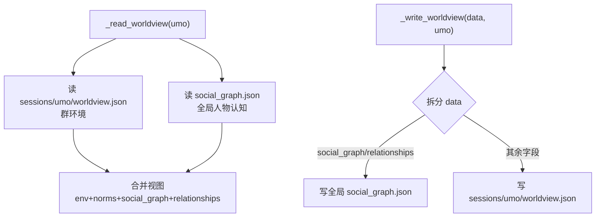

# 设计文档

## Overview

把 worldview 拆成两层隔离粒度：

- **群环境（environment/norms/my_position/external_knowledge）** → 继续按 umo 存在 `sessions/<umo>/worldview.json`（v0.9.8 已隔离）。
- **人物认知（social_graph + relationships）** → 抽到**全局** `social_graph.json`，跨群共用一份。

对外保持透明：`_read_worldview(umo)` 返回**合并视图**（该 umo 群环境 + 全局人物认知），所有既有消费代码（`.get("social_graph")`/`.get("environment")` 等）无需改动。写入侧分流：群环境写会话文件、人物认知写全局文件。

## Architecture



存储布局：

```
data_dir/
├── social_graph.json        ← v0.9.9 全局人物认知 {social_graph, relationships}
├── worldview.json           ← 旧全局（迁移源，保留）
└── sessions/<umo>/
    └── worldview.json        ← 只剩群环境（social_graph/relationships 被移走）
```

## Components and Interfaces

### Social_Store 读写（state_io.py 或 worldview.py）

```python
def _read_social_store(self) -> dict:
    """全局人物认知：{social_graph:{uid:desc}, relationships:{"a->b":desc}}。"""
    return self._read_json(self.social_graph_path,
                           default={"social_graph": {}, "relationships": {}})

def _write_social_store(self, data: dict):
    self._write_json(self.social_graph_path, data)
```

main.py `__init__` 新增 `self.social_graph_path = os.path.join(self.data_dir, "social_graph.json")`。

### 合并视图：`_read_worldview` / `_write_worldview` 改造（worldview.py）

```python
def _read_worldview(self, umo: str = "") -> dict:
    # 群环境（按 umo，含全局回退）
    env = self._read_session_json(umo, "worldview.json", self.worldview_path, default={})
    # 移除旧的人物认知字段（迁移后会话文件可能仍残留，以全局为准）
    env = {k: v for k, v in env.items() if k not in ("social_graph", "relationships")}
    # 全局人物认知
    store = self._read_social_store()
    merged = dict(env)
    merged["social_graph"] = store.get("social_graph", {})
    merged["relationships"] = store.get("relationships", {})
    return merged

def _write_worldview(self, data: dict, umo: str = ""):
    data = dict(data or {})
    sg = data.pop("social_graph", None)
    rel = data.pop("relationships", None)
    # 群环境写会话文件
    self._write_session_json(umo, "worldview.json", data)
    # 人物认知写全局（仅当本次确有这两项）
    if sg is not None or rel is not None:
        store = self._read_social_store()
        if isinstance(sg, dict):
            store["social_graph"] = self._cap_dict(sg, int(self.config.get("social_graph_max", 100)))
        if isinstance(rel, dict):
            store["relationships"] = self._cap_dict(rel, 30)
        self._write_social_store(store)
```

> `_cap_dict(d, n)`：保留最近 n 条（`dict(list(d.items())[-n:])`）。

这样 `_write_worldview` 的调用方（worldview.py 的更新、merged_eval 的 `_apply_relationships_from_map`）**无需改动**——它们照常构造含 social_graph/relationships 的 dict 传进来，由 `_write_worldview` 内部分流。

### `_apply_relationships_from_map` 简化（merged_eval.py）

它现在读改写 worldview 的 relationships。改造后直接走全局 store：

```python
def _apply_relationships_from_map(self, relations, umo: str = ""):
    if not isinstance(relations, dict) or not relations: return
    if self._is_rejected(json.dumps(relations, ensure_ascii=False)): return
    store = self._read_social_store()
    rels = store.get("relationships", {})
    rels.update(relations)
    if len(rels) > _MAX_RELATIONSHIPS:
        rels = dict(list(rels.items())[-_MAX_RELATIONSHIPS:])
    store["relationships"] = rels
    self._write_social_store(store)
```

> umo 参数保留但不再影响存储位置（向后兼容签名）。

### Worldview_Update 分流（worldview.py `_maybe_update_worldview`）

- 读已有画像供 prompt：`full_graph` 从全局 store 取（不从 session worldview）。
- 合并写回：LLM 返回的 social_graph 与全局 full_graph 合并。
- 最终写：构造完整 dict（含 environment + social_graph）传给改造后的 `_write_worldview`，由它分流。

具体改动点：
```python
current_wv = self._read_worldview(umo)          # 已是合并视图，含全局 social_graph
full_graph = current_wv.get("social_graph", {}) # 来自全局 store（经合并视图）
... 截断/合并逻辑不变 ...
self._write_worldview(new_wv, umo)              # 内部分流：env→会话，social_graph→全局
```
**关键：因为 `_read_worldview` 现在返回合并视图、`_write_worldview` 内部分流，`_maybe_update_worldview` 几乎不用改**——它本就读 worldview、改、写回。

### 读取/注入与跨关系传播

- `_get_worldview_text(event)`：读 `_read_worldview(umo)`（合并视图）→ `social_graph` 已是全局，sender 画像跨群统一。无需改。
- `_propagate_cross_relation_scar(uid, umo)`：读 `_read_worldview(umo)`（合并视图）→ `social_graph` 全局。无需改（umo 参数仍在，读到的 social_graph 是全局的）。

> 设计红利：把分流封装进 `_read_worldview`/`_write_worldview`，**绝大多数调用点零改动**。

## Data Models

### social_graph.json（新增全局）

```jsonc
{
  "social_graph": { "1562290139": "妹红，Neuro 粉丝，常开玩笑" },
  "relationships": { "1562290139 -> 1030605256": "群友，互相调侃" },
  "migrated_v099": true
}
```

### sessions/<umo>/worldview.json（改造后）

```jsonc
{
  "environment": "技术宅群，氛围轻松",
  "norms": "可以开黄腔",
  "my_position": "群里的猫娘助手",
  "external_knowledge": [...],
  "last_updated": "..."
  // 不再有 social_graph / relationships
}
```

### 配置项

```jsonc
"social_graph_max": { "type":"int","default":100,
  "hint":"⚪ Token 无。v0.9.9：全局人物画像（social_graph）最大保留条数，超出保留最近 N 条" }
```

## Correctness Properties

### Property 1: 人物认知跨群统一
*对任意* 两个不同 umo A、B，向 A 的 worldview 写入某 user_id 的 social_graph 条目后，从 B 读取 worldview 的 social_graph 包含该条目（全局共享）。
**Validates: Requirements 1.3, 2.3, 5.3**

### Property 2: 群环境仍按群隔离
*对任意* 两个不同 umo，向 A 写入 environment 后从 B 读取的 environment 不含该值（除非 B 走全局回退）。
**Validates: Requirements 2.1, 2.2**

### Property 3: 写入分流正确
*对任意* 含 social_graph + environment 的 worldview dict，`_write_worldview(data, umo)` 后：会话文件不含 social_graph/relationships；全局 store 含 social_graph/relationships；二者各自上限成立（social_graph<=max，relationships<=30）。
**Validates: Requirements 1.4, 1.5, 2.2, 3.1, 4.1**

### Property 4: 合并视图等价
*对任意* 群环境与全局人物认知，`_read_worldview(umo)` 返回的 dict 同时包含该 umo 的 environment 与全局 social_graph/relationships。
**Validates: Requirements 2.3, 5.3**

### Property 5: 迁移幂等
*对任意* 旧 worldview 数据，迁移把 social_graph/relationships 收集进全局 store，写迁移标记；第二次迁移为空操作。
**Validates: Requirements 6.1, 6.2**

## Error Handling

| 场景 | 策略 | 需求 |
| --- | --- | --- |
| social_graph.json 损坏 | _read_json 兜底返回默认空结构 | 1.2 |
| 迁移时会话文件损坏 | 跳过该文件，继续收集其余 | 6.1 |
| 写入分流异常 | 既有 _write_json OSError 兜底 | 3.1 |
| 旧会话文件残留 social_graph | 合并视图读取时以全局为准、过滤掉会话内残留 | 2.2 |

## Testing Strategy

- **属性测试（Hypothesis，≥100 迭代）**：Property 1（跨群统一）、Property 3（写入分流）、Property 5（迁移幂等）。
- **示例测试**：合并视图、群环境隔离、关系写全局、单群等价、配置项。
- **回归**：既有 298 测试全过（特别是 v0.9.8 的隔离测试与 v0.9.2 的关系/合并测试，因 `_write_worldview` 行为变了，相关测试host需同步）。
- 测试用临时 data_dir + 最小宿主混入 StateIOMixin + WorldviewMixin。
