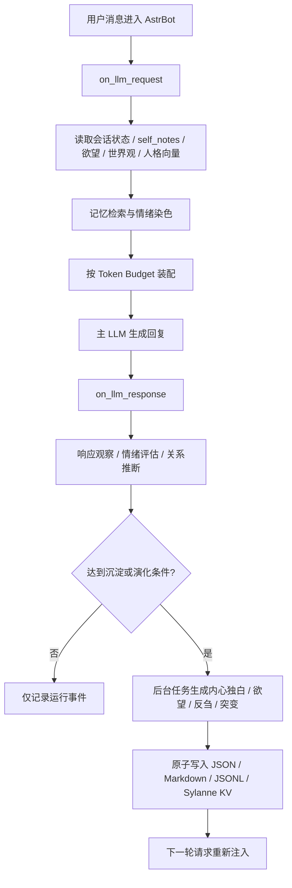

<div align="center">


# Anima

**自主叙事记忆引擎 · AstrBot 插件**

让 AstrBot 角色拥有持续的自我认知、情绪沉淀、人格演化、欲望系统与可观测的叙事记忆。

[](https://github.com/AstrBotDevs/AstrBot)
[](LICENSE)
[](https://github.com/MengBad/astrbot_plugin_anima/releases)

</div>

---

## 项目定位

Anima 不是简单的长期记忆插件。它的目标是让角色在长期交互中形成可持续的“自我”：

| 维度 | Anima 负责什么 |
| --- | --- |
| 自我认知 | 维护角色对“我是谁、我如何理解关系和世界”的持续叙事 |
| 情绪沉淀 | 将高情绪密度事件转化为第一人称内心独白，并持久化 |
| 人格演化 | 使用 5D 人格向量、伤痕维度、矛盾反哺和突变历史影响后续表达 |
| 欲望系统 | 让角色产生、衰减、满足或压抑自己的行动意图 |
| 记忆检索 | 使用向量记忆、情绪染色和多层记忆结构辅助生成上下文 |
| 可观测性 | 通过 Cognitive Observatory 观察注入、状态、任务、记忆、欲望和人格漂移 |

一句话概括：Anima 负责“角色如何记住自己并继续变化”。

---

## 与 Sylanne 的关系和致谢

Anima 的设计灵感和关键关系数学来自 [Sylanne / Ayleovelle](https://github.com/Ayleovelle)。Sylanne-Embodiment 使用 Scar Algebra 与 Void Calculus 描述关系中的伤痕、空洞、压力传导和边界变化。Anima 在此基础上扩展出 AstrBot 插件形态下的叙事记忆、欲望演化和可观测运行系统。

两者的职责边界如下：

| 系统 | 主要职责 |
| --- | --- |
| Sylanne | 关系物理、Scar Algebra、Void Calculus、Relational Sheaf、Body State、Computation Spine |
| Anima | 自我叙事、self_notes、情绪沉淀、欲望队列、世界观、人格漂移、WebUI 观测台 |

从 v1.1.0 起，Anima 深度整合 Sylanne Alpha Host。启用 Sylanne 热路径时，关系状态、会话缓冲、响应观察、部分记忆结构和 WebUI 观测数据会优先通过 Sylanne Alpha 运行；不可用时保留旧 Anima Mixin 路径作为兼容回退。

致谢：

| 来源 | 贡献 |
| --- | --- |
| Ayleovelle / Sylanne | 提供 Scar Algebra、Void Calculus 和关系数学方向，是 Anima 深度整合与叙事扩展的重要来源 |
| AstrBot | 提供插件生命周期、LLM hook、Provider、Plugin Pages 与 WebUI 集成能力 |
| Anima 使用者反馈 | 推动状态原子写入、热重载清理、WebUI 共享路由、认知观测台和安全脱敏能力持续加固 |

---

## 核心原理

Anima 的关键循环是“对话事件转为内部经验，再在下一次对话中影响表达”。



主要工程机制：

| 机制 | 作用 |
| --- | --- |
| Mixin 组合 | 将 StateIO、Emotion、Sediment、Rumination、Desire、Scars、Danger、Stats 等职责拆分组合 |
| ContextVar helper bypass | 内部 LLM 调用标记为 helper call，避免被自己的 `on_llm_request` 再次拦截污染上下文 |
| SessionLockDict | 为会话级读写提供隔离，降低跨群、私聊之间的状态串扰 |
| BackgroundTaskSet | 管理后台沉淀、反刍、响应观察、分段发送和 checkpoint 任务 |
| State injection budget | 限制每次注入的字符数、槽位数和优先级，避免 prompt 膨胀 |
| 原子写入 | 关键 JSON/Markdown 写入使用临时文件、flush/fsync 和 `os.replace`，降低半写入损坏风险 |
| 脱敏观测 | WebUI 观测 API 默认只暴露长度、计数、分桶、指纹和状态，不返回原始对话、prompt 或人格片段 |

---

## 功能概览

### 默认核心能力

| 功能 | 说明 |
| --- | --- |
| 情绪触发沉淀 | 回复后评估情绪强度，超过阈值时生成第一人称内心独白 |
| self_notes 注入 | 将角色自我认知笔记注入后续上下文 |
| 演化日志 | 记录自我认知变化、沉淀、突变和回滚等事件 |
| 拒答过滤 | 模型拒绝或空洞输出不会写入核心记忆 |
| 敏感内容过滤 | 对密钥、token、高熵字符串等做写入前过滤 |
| WebUI 编辑 | 在统一 Plugin Page 中查看和编辑运行状态 |

### 可选认知模块

| 模块 | 默认 | 说明 |
| --- | --- | --- |
| 向量记忆 | 需配置 Embedding | 检索语义相关历史，提高沉淀和注入质量 |
| 欲望系统 | 关闭 | 维护角色主动意图，支持满足、衰减、压抑和演化 |
| 世界观系统 | 关闭 | 维护角色对群环境、规范和位置的理解 |
| 时间感 | 关闭 | 追踪互动频率、缺席感和关系时间重量 |
| 自然遗忘 | 关闭 | 让旧记忆随时间模糊，被重新命中时唤醒 |
| 矛盾检测 | 关闭 | 扫描 self_notes 内部冲突，并将未解决矛盾反哺上下文 |
| 离线反刍 | 关闭 | 后台反思近期经历，不直接发给用户 |
| 工具自学习 | 关闭 | 观察工具使用结果，形成偏好和个人能力 |

### 高风险自主性模块

这些功能全部默认关闭。开启前应先在测试环境验证。

| 功能 | 开关 | 风险 |
| --- | --- | --- |
| 主动信息收集 | `danger_active_info_collection` | 可能让用户感觉被追问 |
| 自主网络行动 | `danger_autonomous_web` | 可能产生不可控外部请求 |
| 关系图谱推断 | `danger_relationship_inference` | 错误推断会影响后续关系认知 |
| 立场自主传播 | `danger_stance_propagation` | 角色可能主动表达未预期立场 |
| 核心人格突变 | `danger_core_mutation` + `_confirm` | 可能改写 `persona_core.yaml` 并产生长期影响 |
| 身份危机 | `danger_identity_crisis` | 角色可能进入不稳定表达状态 |
| 记忆感染 | `danger_memory_infection` + `_confirm` | 具有明显操控风险，需谨慎启用 |

---

## Cognitive Observatory

v1.2.7 将 WebUI 收束为一个统一 AstrBot Plugin Page：`Anima Portal`。旧 dashboard 与 capability-tree 仍保留为内部 iframe 页面，不再作为多个顶层入口暴露。

| 面板 | 说明 |
| --- | --- |
| Runtime Timeline | 运行时认知事件时间线 |
| Prompt Debugger | 注入槽位、预算、截断和请求形状调试，不返回 prompt 正文 |
| State Inspector | 会话、脏状态、持久化文件、StateStore audit 和 KV 可用性检查 |
| StateStore Audit | 只读状态源拓扑审计，展示 file/runtime/session/KV 来源、完整拓扑元数据指纹与 snapshot/diff/rollback 能力缺口 |
| Background Tasks | 后台任务、队列、异常、重试和 checkpoint 状态 |
| Memory Explorer | L1/L2/L3 记忆拓扑、计数、指纹和 consolidation 状态 |
| Memory Recall Replay | 最近记忆召回证据回放，不触发新检索 |
| Desire Dashboard | 欲望队列健康度、强度分布和状态分桶 |
| Desire Evolution | 欲望生命周期事件与队列变化 |
| Scar Explorer | 创伤代数、legacy scar 维度和愈合阶段 |
| Personality Drift | 5D 人格向量、surface traits 与 core-belief 变化指纹 |
| Reasoning Trace | 由运行事件、prompt 调试、响应观察和工具元数据组成的脱敏推理轨迹 |
| Session Replay | 会话消息形状和事件回放，只暴露长度与指纹 |
| Mutation History | 突变历史脱敏视图，只暴露类型、时间、长度和指纹 |

共享 AstrBot Plugin Page 路径使用 `/astrbot_plugin_anima/api/...`，并兼容 AstrBot 前端打开的 `/astrbot_plugin_anima/anima` 页面别名。独立 Sylanne WebUI 仍使用 `/api/...`。Portal 会自动识别当前入口并选择正确路径；即使运行在 stdlib fallback 服务器上，也会提供 dashboard/capability-tree 内部页、Observatory API、`?token=` 鉴权和 mutation rollback POST 路由。

---

## 快速开始

1. 将插件目录放入 AstrBot 的 `data/plugins/`，或通过 AstrBot WebUI 上传插件压缩包。
2. 在 AstrBot 插件管理中启用 `astrbot_plugin_anima`。
3. 保持默认配置即可开始使用。
4. 如需向量记忆，在 AstrBot Provider 中添加 Embedding Provider，并把 ID 填入 `embedding_provider_id`。
5. 如需 WebUI 观测台，开启 `sylanne_webui_enabled`，然后使用 `/anima_dashboard_url` 获取入口。

运行要求：

| 项 | 要求 |
| --- | --- |
| AstrBot | `>= 4.25` |
| Python | 跟随 AstrBot 运行环境 |
| 运行依赖 | 见 `requirements.txt` |
| 开发测试依赖 | 见 `requirements-dev.txt` |

---

## 推荐配置

| 配置项 | 默认 | 建议 |
| --- | --- | --- |
| `enabled` | `true` | 总开关，通常保持开启 |
| `emotion_threshold` | `0.6` | 越低越容易沉淀，token 和写入量会增加 |
| `embedding_provider_id` | 空 | 推荐配置，能明显改善记忆检索和沉淀质量 |
| `internal_provider_id` | 空 | 推荐使用成本低、审查宽松的模型处理内部总结 |
| `persona_prompt` | 空 | 需要强稳定人设时填写，注入 system prompt 前部 |
| `persona_lock` | `false` | 需要防止核心人格被突变改写时开启 |
| `sediment_merge_llm_calls` | `false` | 想降低内部 token 消耗时可开启并观察 `/anima_stats` |
| `dashboard_enabled` | `true` | 保留运行统计和观测数据 |
| `sylanne_webui_enabled` | 依配置 | 需要 Portal 或独立 WebUI 时开启 |

完整配置以 `_conf_schema.json` 为准。README 只列推荐项，避免重复维护导致文档与 schema 不一致。

---

## 角色人设的三层结构

| 层级 | 写入位置 | 注入位置 | 用途 |
| --- | --- | --- | --- |
| AstrBot 人格设定 | AstrBot 角色配置 | system prompt | 基础设定、说话风格、背景 |
| `persona_prompt` | Anima 插件配置 | system prompt 前部 | 高权重稳定人设 |
| `persona_core.yaml` | 插件数据目录 | Anima 状态块 | 核心规则、边界、自我认知约束 |
| `seed_persona` | Anima 插件配置 | 首次写入 self_notes | 初始自我认知种子，只在空笔记时生效 |

`persona_lock=true` 后，`danger_core_mutation` 不再改写 `persona_core.yaml`。这不会停止情绪、欲望、世界观和普通 self_notes 演化。

---

## 常用指令

| 指令 | 说明 |
| --- | --- |
| `/anima_help` | 查看指令总览 |
| `/anima_notes` | 查看当前自我认知摘要 |
| `/anima_log [n]` | 查看最近 n 条演化记录 |
| `/anima_reset` | 重置自我认知，保留演化日志 |
| `/anima_desires` | 查看欲望队列 |
| `/anima_world` | 查看世界观 |
| `/anima_world_update` | 手动触发世界观更新 |
| `/anima_contradictions` | 查看矛盾记录 |
| `/anima_why <关键词>` | 追溯某个认知或立场的形成过程 |
| `/anima_stability` | 查看身份稳定度 |
| `/anima_tools` | 查看工具使用统计 |
| `/anima_core` | 查看核心规则 |
| `/anima_capabilities [页码|all]` | 查看个人能力库 |
| `/anima_autonomy` | 查看自主演化概览 |
| `/anima_export_capabilities` | 导出完整能力树 JSON |
| `/anima_stats` | 查看今日运行统计和 token 消耗线索 |
| `/anima_dashboard_url` | 获取 WebUI 入口 |
| `/anima_capabilities_audit` | 只读体检个人能力库 |
| `/anima_scan_rejects` | 只读扫描拒答或注入污染规模 |

---

## 持久化路径

默认数据目录：

```text
data/plugin_data/astrbot_plugin_anima/
├── self_notes.md
├── evolution_log.jsonl
├── anima_state.json
├── desires.json
├── worldview.json
├── time_sense.json
├── contradictions.json
├── persona_core.yaml
├── social_graph.json
├── personal_capabilities.json
├── runtime_events.jsonl
└── sessions/
    └── <session_key>/
        ├── worldview.json
        └── time_sense.json
```

设计原则：

| 文件 | 说明 |
| --- | --- |
| `self_notes.md` | 角色自我认知笔记，人类可读，可通过 WebUI 编辑 |
| `evolution_log.jsonl` | 自我认知和状态演化日志 |
| `anima_state.json` | 运行状态、人格向量、突变历史等 |
| `desires.json` | 欲望队列 |
| `persona_core.yaml` | 核心人格规则，可被高风险突变模块改写 |
| `social_graph.json` | 跨会话共享的人物认知和关系图谱 |
| `sessions/` | 会话级 worldview/time_sense 隔离，避免群聊之间串状态 |
| `runtime_events.jsonl` | Cognitive Observatory 的运行事件时间线 |

v0.9.8 之后，角色本体人格跨会话共享；群环境和时间感按 session 隔离。v0.9.9 之后，人物认知抽到全局 `social_graph.json`，同一个人在多个群中的认知保持统一。

---

## 安全边界

Anima 内置多层降级和保护，但它仍然会写入长期状态。生产环境建议遵守以下原则：

| 风险 | 建议 |
| --- | --- |
| 敏感信息进入长期记忆 | 不要在对话中发送密钥、密码、token；过滤器是防线，不是保证 |
| 高风险 autonomy | 先在测试环境开启，确认行为符合预期后再进入群聊 |
| 核心人格突变 | 同时需要 `danger_core_mutation` 和 `_confirm`；需要稳定人设时开启 `persona_lock` |
| WebUI 暴露 | 独立 WebUI token 只应给可信用户，避免暴露在不可信网络 |
| 多源持久化 | 升级前备份 `data/plugin_data/astrbot_plugin_anima/` 和 Sylanne alpha 数据目录 |
| 代码执行能力 | `allow_capability_code_execution` 默认关闭；除非明确理解风险，否则不要开启 |

---

## 测试与当前发布状态

当前版本：`v1.2.8`

最近一次全量回归：

```text
406 passed, 50 warnings
```

重点覆盖：

| 覆盖范围 | 说明 |
| --- | --- |
| Phase 2 稳定性 | 原子写入、状态损坏备份、后台任务收束、response observation |
| WebUI 路由 | 共享 Plugin Page 与独立 Sylanne WebUI 的 API 路径差异 |
| Cognitive Observatory | Runtime Events、Prompt Debugger、State Inspector、Background Tasks、Memory/Desire/Scar/Personality/Trace/Replay |
| 安全脱敏 | 不返回原始 prompt、消息正文、记忆文本、欲望正文、persona_core 片段；Reasoning Trace 通用事件 fallback 只保留安全元数据 |
| 高风险回滚 | mutation history 脱敏和 persona_core rollback 原子交换 |

---

## 设计取舍

Anima 的架构 deliberately 保留了旧 Mixin 路径与 Sylanne Alpha 热路径并存。这增加了维护复杂度，但换来三个现实收益：

| 取舍 | 原因 |
| --- | --- |
| 双路径兼容 | 老用户状态文件、旧 Anima Mixin 行为和 Sylanne 新热路径都能继续运行 |
| 大量脱敏观测 | 可调试性和隐私之间取平衡，只暴露形状、长度、分桶和指纹 |
| 高风险功能默认关闭 | 保留自主性研究空间，同时避免默认破坏用户体验 |
| 文本 self_notes | 相比纯结构化状态更容易人工理解、编辑和备份 |

---

## License

本项目基于 [MIT License](LICENSE) 开源。

如果使用、二次开发或引用 Anima 的 Sylanne 整合设计，请同时保留对 Sylanne / Ayleovelle 的来源说明。
